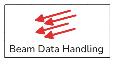
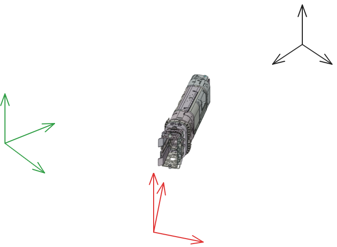

# Beam Data Handling

Batch processing GUI for `.vtp` files produced by [BeamOnTarget](https://github.com/CharlieHills92/BeamOnTarget).



---

## Features

- **Edge smoothing** — iterative neighbour-mean smoothing restricted to boundary/feature cells
- **Snapshots** — offscreen VTK renders coloured by Power Density (W/m²) and/or Total Power (W)
- **CSV export** — `max_comparison_batch.csv` (peak power density before/after) and `total_power_batch.csv`
- **Coordinate transform** — rotate + translate per-cell CSV data between beam and tokamak frames
- **Per-component config** — smooth iterations, multiplication factor, and snapshot toggles saved to JSON

---

## Project Structure

```
Value_extract/
├── Data_handling.py          # Entry point (GUI + pipeline orchestration)
├── requirements.txt
├── install.bat / install.sh
└── modules/
    ├── core/                 # settings.py, path_utils.py
    ├── vtk/                  # vtk_io.py, smoothing.py, snapshot_max.py
    ├── processing/           # pipeline.py, workers.py
    ├── transform/            # transform_reference_frame.py, generate_report.py, ...
    └── gui/                  # gui_tab1.py, gui_tab2.py, coordinates.png
```

---

## Requirements

- Python 3.10+
- `vtk >= 9.6.2`
- `numpy >= 2.4.6`
- `openpyxl >= 3.1.5`
- `tqdm >= 4.0`
- `pyvista >= 0.44` (used by `generate_report.py`)

```bash
pip install -r requirements.txt
```

---

## Quick Start

```powershell
# First time — create venv and install dependencies
.\install.bat

# Launch
python .\Data_handling.py
```

Optional (without venv):

```powershell
pvpython .\Data_handling.py
```

---

## Usage

### Tab 1 — Processing

1. Paste input directory paths (one per line). `OUTPUT_*` folders expand automatically.
2. Click **Load Geometry** to scan for `.vtp` files and populate the component list.
3. Per component: set smooth iterations, multiplication factor, and which snapshots to render.
4. Click **Run Processing**.

Outputs written to the chosen output folder:

| File | Contents |
|---|---|
| `max_comparison_batch.csv` | case / scenario / filename / max before & after smoothing |
| `total_power_batch.csv` | total deposited power per file |
| `snapshots/` | PNG renders (power density and/or total power) |

### Tab 2 — Coordinate Transform

Select a preset (e.g. *DNB → Tokamak*), choose input/output units, and click **Run Transform**.  
Per-cell geometry and power data are extracted to CSV and rotated/translated into the target frame.




---
## Path Structure

The tool automatically detects case and scenario names from the folder hierarchy:

| Structure | `case` | `scenario` |
|---|---|---|
| `OUTPUT_CDL/FFTC/dnb_3_+10_+2/SMOOTHED/` | `FFTC` | `dnb_3_+10_+2` |
| `OUTPUT_FFTC/dnb_3_+10_+2/SMOOTHED/` | `FFTC` | `dnb_3_+10_+2` |

---

## Config File

Settings are saved automatically to `config/data_handling_settings.json` on each run and restored on next launch. You can also save/load named config files from the GUI using the **Save config** / **Load config** buttons.
